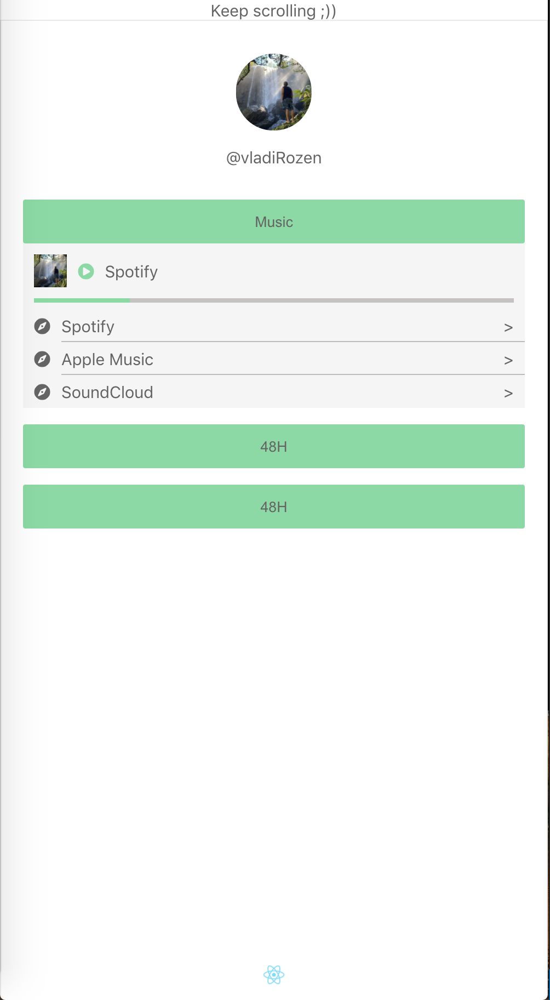
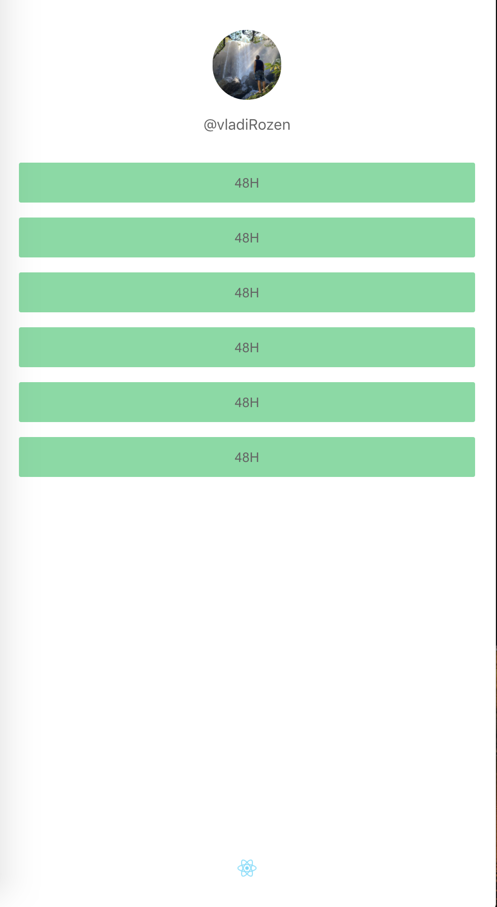
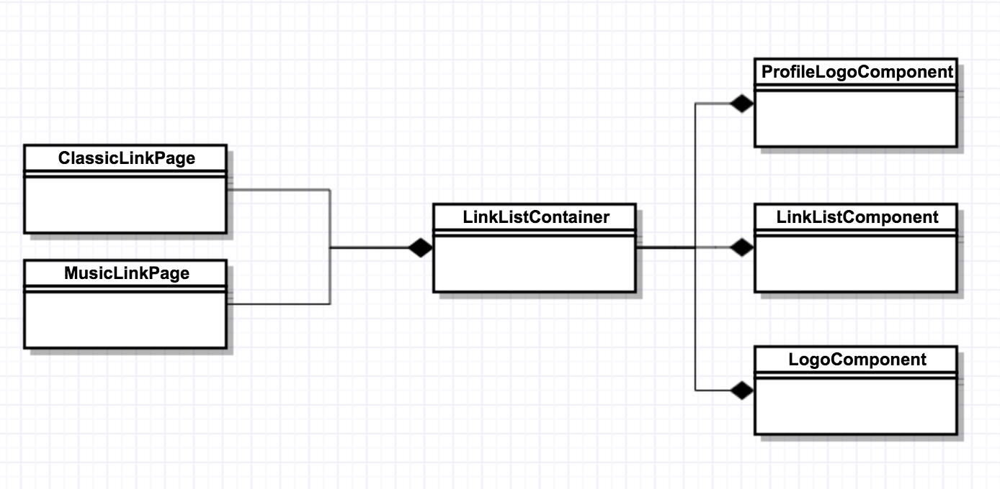

Run with:
 
yarn install
 
yarn start
 

Run Storybook with:
 
yarn run storybook

 
 

<h5>
All pages are rendered through the same component: LinkListContainer.
This component contains the three parts of each page: profile, links list and bottom logo.
The links list component (LinkListComponent) will render a dynamic list from a configuration object that is being passed from the main page component.
This way allows the simple creation of new pages and extensions in the future.
</h5>
 
 

<h5>
Configuration example:
const linkComponents = [
    {
      type: LINK_COMPONENTS.musicLink,
      props: {
        id: 0,
        label: "Music",
        musicUrls: [
          {
            id: 0,
            label: 'Spotify',
            url: 'www',
          },
        ],
    }
  },
  {
    type: LINK_COMPONENTS.button,
    props: {
      id: 1,
      label: "48H",
    },
  },
];

<h5>